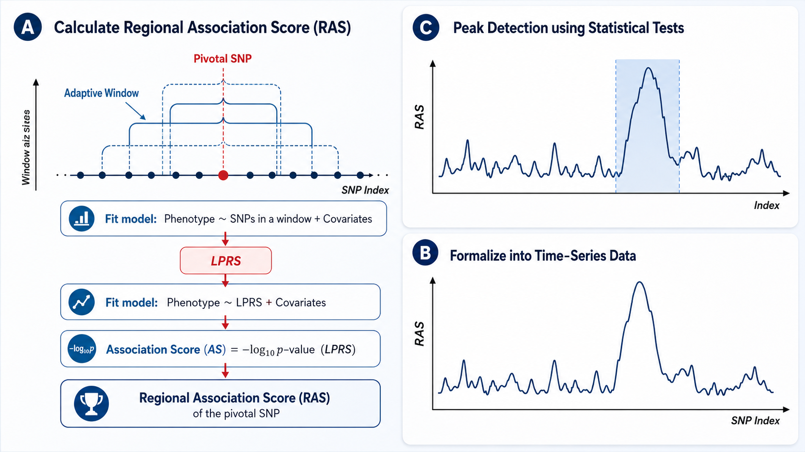

# RAS: Regional Association Score for GWAS
<p align="center">
  
</p>
The <strong>RAS</strong> package implements the Regional Association Score method for genome-wide association studies. It converts per-SNP effect sizes into a genomic −log₁₀(*p*) time series and applies changepoint detection to locate peaks that mark significant association regions. The method supports both continuous and binary traits.

If you use this package in your research, please cite:

> Y. Jiang & H. Zhang, Empowering genome-wide association studies via a visualizable test based on the regional association score, *Proc. Natl. Acad. Sci. U.S.A.* 122(9) e2419721122 (2025). https://doi.org/10.1073/pnas.2419721122

---


## Installation

### From CRAN (recommended)

```r
install.packages("RAS")
```

### From GitHub

```r
# install remotes if you don't have it
install.packages("remotes")

remotes::install_github("hepingzhangyale/RAS")
```

---

## Dependencies

RAS imports the following packages, which are installed automatically:

| Package | Role |
|---------|------|
| `segmented` | Segmented regression and Davies test for changepoint detection |
| `parallel` | CPU core detection used by `ras_memory()` diagnostics |
| `stats`, `graphics`, `grDevices` | Base R statistics and plotting |

If automatic installation fails, install them manually first:

```r
install.packages(c("segmented", "parallel"))
```

---

## Quick start

```r
library(RAS)

result <- ras(
  geno, phenotype, covariates,
  covariate_cols = c("age", "sex", paste0("pc", 1:10)),
  is_continuous  = TRUE,
  chrom          = 1,
  save_dir       = "results/"
)

print(result)              # detected changepoint positions
plot(result)               # full-chromosome scan profile
plot(result, zoom = TRUE)  # zoomed view around each changepoint
```

### Binary traits: fast score test

For binary (case/control) traits, the per-window scan defaults to a logistic
regression (`scan_test = "glm"`). On large samples this Wald path is the main
cost. Passing `scan_test = "score"` uses a Rao score test that fits the
covariate-only null model once and evaluates each window in closed form —
substantially faster with essentially the same detected regions:

```r
result <- ras(
  geno, phenotype, covariates,
  covariate_cols = c("age", "sex", paste0("pc", 1:10)),
  is_continuous  = FALSE,
  scan_test      = "score",   # fast Rao score test for the binary scan
  chrom          = 1,
  save_dir       = "results/"
)
```

## Step-by-step (advanced)

```r
# Step 1: compute averaged -log10(p) profile
scan <- ras_scan(
  geno, phenotype, covariates,
  covariate_cols = c("age", "sex", paste0("pc", 1:10)),
  is_continuous  = TRUE,
  chrom = 1, save_dir = "results/"
)

# Step 2: first-pass changepoint detection
detected <- ras_detect(
  scan$x, scan$y,
  window_size                    = 3000,
  slope.p.values.threshold.left  = 1e-10,
  slope.p.values.threshold.right = 1e-20
)

# Step 3: second-pass validation
final <- ras_validate(
  detected, x = scan$x, y = scan$y,
  this.skip         = 10,
  p.value.threshold = 1e-10
)

# Step 4: plot
result <- structure(
  list(scan = scan, detection = final, chrom = 1, save_dir = "results/"),
  class = "ras"
)
plot(result)
```

## Documentation

```r
?RAS          # package overview and full pipeline description
?ras          # main one-call entry point
?ras_scan     # Stage 1: scan
?ras_detect   # Stage 2: first-pass changepoint detection
?ras_validate # Stage 3: second-pass validation
?plot.ras     # plotting
?ras_memory   # memory and CPU diagnostics
```

---

## Example

A worked, real-data walk-through on a Duroc pig GWAS dataset (backfat thickness,
352 pigs, 36,120 SNPs) is in
[`examples/pig-example`](examples/pig-example). It goes from raw PLINK files
through data preview and PLINK marginal GWAS to running RAS two ways.

> **Note:** the example's detected region and result figures are withheld pending
> publication of the associated paper — the notebook shows the data and how to run
> RAS, with the result cells left unexecuted.

---

## Citation

If you use RAS in your research, please cite:

Y. Jiang & H. Zhang, Empowering genome-wide association studies via a visualizable test based on the regional association score, *Proc. Natl. Acad. Sci. U.S.A.* 122(9) e2419721122 (2025). https://doi.org/10.1073/pnas.2419721122

## Authors

- Jiahe Jin &lt;jiahe.jin@yale.edu&gt; (maintainer)
- Yiran Jiang &lt;yiran.jiang@uky.edu&gt;
- Heping Zhang &lt;heping.zhang@yale.edu&gt;
